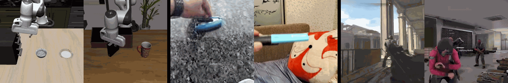

# Learning Adaptable World Models with Latent Actions

[](https://adaptable-world-model.github.io)
[](https://arxiv.org/abs/2503.18938)
[](https://huggingface.co/Little-Podi/AdaWorld)

[](https://pytorch.org)
[](https://www.python.org)
[](LICENSE)

[Shenyuan Gao](https://github.com/Little-Podi), [Siyuan Zhou](https://rainbow979.github.io), [Yilun Du](https://yilundu.github.io), [Jun Zhang](https://eejzhang.people.ust.hk), [Chuang Gan](https://people.csail.mit.edu/ganchuang)

<hr style="border: 2px solid gray;"></hr>

**TL;DR:** *AdaWorld is a highly adaptable world model pretrained with continuous latent actions from thousands of environments, enabling zero-shot action transfer, fast adaptation, and new skill acquisition with minimal finetuning.*


We introduce latent actions as a unified condition for action-aware pretraining from videos. AdaWorld can readily transfer actions across contexts without training. By initializing the control interface with the corresponding latent actions, AdaWorld can also be adapted into specialized world models efficiently and achieve significantly better planning results.

<hr style="border: 2px solid gray;"></hr>

- Action transfer (source video &rarr; target scene)

<div id="top" align="center">
<p align="center">

</p>
</div>

- Visual planning (action-agnostic vs. AdaWorld)

<div id="top" align="center">
<p align="center">

</p>
</div>

<hr style="border: 2px solid gray;"></hr>

## 🕹️ Getting Started

- [Installation](https://github.com/Little-Podi/AdaWorld/blob/main/docs/INSTALLATION.md)
- [Training](https://github.com/Little-Podi/AdaWorld/blob/main/docs/TRAINING.md)
- [Action Transfer](https://github.com/Little-Podi/AdaWorld/blob/main/docs/TRANSFER.md)
- [World Model Adaptation](https://github.com/Little-Podi/AdaWorld/blob/main/docs/ADAPTATION.md)
- [Visual Planning](https://github.com/Little-Podi/AdaWorld/blob/main/docs/PLANNING.md)
- [Trouble Shooting](https://github.com/Little-Podi/AdaWorld/blob/main/docs/ISSUES.md)

## ❣️ Acknowledgement

Our idea is implemented based on [Vista](https://github.com/OpenDriveLab/Vista) and [Jafar](https://github.com/flairox/jafar). Thanks for their great open-source work!

## 🌟 Citation
If any parts of our paper and code help your research, please consider citing us and giving a star to our repository.
```
@article{gao2025adaworld,
  title={AdaWorld: Learning Adaptable World Models with Latent Actions}, 
  author={Gao, Shenyuan and Zhou, Siyuan and Du, Yilun and Zhang, Jun and Gan, Chuang},
  journal={arXiv preprint arXiv:2503.18938},
  year={2025}
}
```

## ✉️ Contact

If you have any questions or comments, feel free to contact me through email (sygao@connect.ust.hk). Suggestions and collaborations are also highly welcome!
